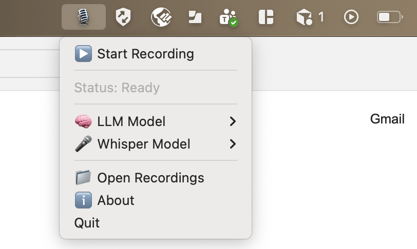

# 🎙️ GGML Meeting Recorder

A **local AI-powered meeting recorder** that transcribes, summarizes, and extracts action items from your meetings—all running **100% offline** on your Mac using Apple Silicon.

> **No cloud. No API costs. No data leaving your machine.**

Built with [GGML](https://github.com/ggml-org/ggml), the tensor library that powers local AI on consumer hardware.


---

## ✨ Features

- 🎤 **One-click recording** from the menu bar
- 🗣️ **Speech-to-text** using whisper.cpp (OpenAI's Whisper model)
- 📝 **AI summarization** with multiple LLM options
- ✅ **Action item extraction** as a to-do list
- 🔄 **Model switching** - choose between DeepSeek, Qwen, Mistral, Llama
- 🔒 **100% private** - everything runs locally
- 💰 **Zero recurring costs** - no API fees

---

## 🖥️ Screenshot



---

## 📋 Requirements

- **macOS** with Apple Silicon (M1, M2, M3, M4)
- **RAM**: 
  - Minimum: 8GB (for small models)
  - Recommended: 32GB+ (for 7B-8B models)
  - Optimal: 64GB+ (for 32B-72B models)
- **Storage**: ~20GB for models (more for larger models)
- **Python 3.9+**
- **Xcode Command Line Tools** (`xcode-select --install`)

---

## 🚀 Quick Start

### 1. Clone the Repository

```bash
git clone https://github.com/enesbasbug/GGML-Meeting-Recorder.git
cd GGML-Meeting-Recorder
```

### 2. Run the Setup Script

```bash
chmod +x setup.sh
./setup.sh
```

This will:
- Install Python dependencies
- Clone and build whisper.cpp with Metal support
- Download the Whisper models
- Download starter LLM models

### 3. Start the App

```bash
python3 MeetingRecorder.py
```

Or double-click `Start.command`

Look for the **🎙️ icon** in your menu bar!

---

## 🔧 Manual Setup

If you prefer to set up manually:

### Install Python Dependencies

```bash
pip3 install rumps sounddevice numpy scipy --user
```

### Build whisper.cpp

```bash
git clone https://github.com/ggml-org/whisper.cpp.git
cd whisper.cpp
mkdir build && cd build
cmake .. -DGGML_METAL=ON
cmake --build . --config Release -j 8
cd ..

# Download Whisper models
./models/download-ggml-model.sh base.en      # Fast (141MB)
./models/download-ggml-model.sh large-v3     # Best quality (2.9GB)
```

### Build llama.cpp

```bash
git clone https://github.com/ggml-org/llama.cpp.git
cd llama.cpp
mkdir build && cd build
cmake .. -DGGML_METAL=ON
cmake --build . --config Release -j 8
```

### Download LLM Models

```bash
mkdir -p models

# DeepSeek R1 8B - State-of-the-art reasoning
python3 -c "from huggingface_hub import hf_hub_download; hf_hub_download('bartowski/DeepSeek-R1-Distill-Llama-8B-GGUF', 'DeepSeek-R1-Distill-Llama-8B-Q4_K_M.gguf', local_dir='models')"

# Qwen 2.5 7B - Excellent for summarization
python3 -c "from huggingface_hub import hf_hub_download; hf_hub_download('bartowski/Qwen2.5-7B-Instruct-GGUF', 'Qwen2.5-7B-Instruct-Q4_K_M.gguf', local_dir='models')"

# Mistral 7B - Fast and balanced
python3 -c "from huggingface_hub import hf_hub_download; hf_hub_download('bartowski/Mistral-7B-Instruct-v0.3-GGUF', 'Mistral-7B-Instruct-v0.3-Q4_K_M.gguf', local_dir='models')"
```

---

## 🧠 Available Models

### LLM Models (for summarization)

| Model | Size | RAM Needed | Best For |
|-------|------|------------|----------|
| **Llama 3.2 3B** | 1.9GB | ~4GB | Quick summaries, testing |
| **DeepSeek R1 8B** | 4.6GB | ~8GB | Complex reasoning, analysis |
| **Qwen 2.5 7B** | 4.4GB | ~8GB | Summarization, instructions |
| **Mistral 7B** | 4.1GB | ~6GB | Balanced speed/quality |

### Premium Models (for 64GB+ RAM systems)

| Model | Size | RAM Needed | Quality |
|-------|------|------------|---------|
| **Llama 3.3 70B** ⭐ | ~40GB | ~50GB | Best dense Llama model |
| **DeepSeek R1 32B** | ~19GB | ~25GB | Excellent reasoning |
| **Qwen 2.5 72B** | ~42GB | ~55GB | Best summarization |

Download premium models:

```bash
# Llama 3.3 70B (Best dense model for summarization)
python3 -c "from huggingface_hub import hf_hub_download; hf_hub_download('bartowski/Llama-3.3-70B-Instruct-GGUF', 'Llama-3.3-70B-Instruct-Q4_K_M.gguf', local_dir='models')"

# DeepSeek R1 32B (Best reasoning under 70B)
python3 -c "from huggingface_hub import hf_hub_download; hf_hub_download('bartowski/DeepSeek-R1-Distill-Qwen-32B-GGUF', 'DeepSeek-R1-Distill-Qwen-32B-Q4_K_M.gguf', local_dir='models')"

# Qwen 2.5 72B (Best for summarization)
python3 -c "from huggingface_hub import hf_hub_download; hf_hub_download('bartowski/Qwen2.5-72B-Instruct-GGUF', 'Qwen2.5-72B-Instruct-Q4_K_M.gguf', local_dir='models')"
```

### Whisper Models (for speech-to-text)

| Model | Size | Speed | Accuracy |
|-------|------|-------|----------|
| **base.en** | 141MB | ~150ms/10s | Good |
| **small.en** | 466MB | ~300ms/10s | Better |
| **medium.en** | 1.5GB | ~800ms/10s | Very Good |
| **large-v3** | 2.9GB | ~2s/10s | Best |

---

## 📁 Project Structure

```
ggml-meeting-recorder/
├── MeetingRecorder.py     # 🎯 Main app (run this!)
├── Start.command          # Double-click to launch
├── setup.sh               # Automated setup (run first)
├── requirements.txt       # Python dependencies
├── README.md              # This file
├── LICENSE                # MIT License
│
├── models/                # Downloaded by setup.sh (not in git)
│   ├── Llama-3.3-70B-Instruct-Q4_K_M.gguf
│   ├── DeepSeek-R1-Distill-Qwen-32B-Q4_K_M.gguf
│   └── ...
│
├── recordings/            # Your recordings (not in git)
│   └── meeting_YYYY-MM-DD_HH-MM-SS/
│       ├── recording.wav
│       ├── transcript.txt
│       ├── summary.txt
│       ├── todos.txt
│       └── full_report.txt
│
└── whisper.cpp/           # Cloned by setup.sh (not in git)
    ├── build/bin/whisper-cli
    └── models/ggml-large-v3.bin
```

---

## 🎯 How It Works

```
┌─────────────────────────────────────────────────────────────────┐
│                     Your Meeting Recording                       │
└─────────────────────────────────────────────────────────────────┘
                              │
                              ▼
┌─────────────────────────────────────────────────────────────────┐
│                    whisper.cpp (GGML)                            │
│                    Speech → Text                                 │
│              Uses Metal GPU for acceleration                     │
└─────────────────────────────────────────────────────────────────┘
                              │
                              ▼
┌─────────────────────────────────────────────────────────────────┐
│                    llama.cpp (GGML)                              │
│           Summarization + Action Item Extraction                 │
│              Uses Metal GPU for acceleration                     │
└─────────────────────────────────────────────────────────────────┘
                              │
                              ▼
┌─────────────────────────────────────────────────────────────────┐
│  📄 transcript.txt  │  📋 summary.txt  │  ✅ todos.txt          │
└─────────────────────────────────────────────────────────────────┘
```

---

## 🔍 What is GGML?

**GGML** (Georgi Gerganov Machine Learning) is a C library that enables running large AI models on consumer hardware.

### Key Features:
- **Quantization**: Shrinks models from 100GB+ to a few GB with minimal quality loss
- **Metal Support**: Runs on Apple's GPU via Metal
- **Unified Memory**: On Apple Silicon, the GPU can use all your RAM
- **No Dependencies**: Pure C, no Python/CUDA required at runtime

### Why GGML on Apple Silicon is Special:
- **PC**: GPU limited to VRAM (8-24GB typically)
- **Mac**: GPU can use ALL unified memory (up to 192GB on M4 Max!)

This means a 128GB Mac can run 70B+ parameter models that would need $20,000+ of NVIDIA hardware elsewhere.

---

## 🛠️ Troubleshooting

### "whisper-cli not found"
```bash
cd whisper.cpp && mkdir -p build && cd build
cmake .. -DGGML_METAL=ON && cmake --build . --config Release -j 8
```

### "No audio devices found"
- Check System Preferences → Security & Privacy → Microphone
- Grant Terminal/Python access to the microphone

### "Model file not found"
- Ensure models are downloaded to the correct `models/` directory
- Check the file names match exactly

### App doesn't appear in menu bar
- Check if another instance is already running: `pkill -f MeetingRecorder`
- Run from terminal to see error messages: `python3 MeetingRecorderPro.py`

---

## 📊 Performance Benchmarks

*On M4 Max with 128GB RAM:*

| Task | Model | Speed |
|------|-------|-------|
| Transcription | Whisper Large V3 | ~2s for 60s audio |
| Summarization | DeepSeek R1 8B | ~150 tokens/sec |
| Summarization | Llama 3.3 70B | ~30 tokens/sec |

---

## 🤝 Contributing

Contributions are welcome! Please feel free to submit a Pull Request.

1. Fork the repository
2. Create your feature branch (`git checkout -b feature/AmazingFeature`)
3. Commit your changes (`git commit -m 'Add some AmazingFeature'`)
4. Push to the branch (`git push origin feature/AmazingFeature`)
5. Open a Pull Request

---

## 📜 License

This project is licensed under the MIT License - see the [LICENSE](LICENSE) file for details.

---

## 🙏 Acknowledgments

- [GGML](https://github.com/ggml-org/ggml) - The tensor library that makes this possible
- [whisper.cpp](https://github.com/ggml-org/whisper.cpp) - Speech-to-text implementation
- [llama.cpp](https://github.com/ggml-org/llama.cpp) - LLM inference implementation
- [rumps](https://github.com/jaredks/rumps) - macOS menu bar framework
- Model creators: Meta (Llama), DeepSeek, Alibaba (Qwen), Mistral AI
- [bartowski](https://huggingface.co/bartowski) - For high-quality GGUF quantizations

